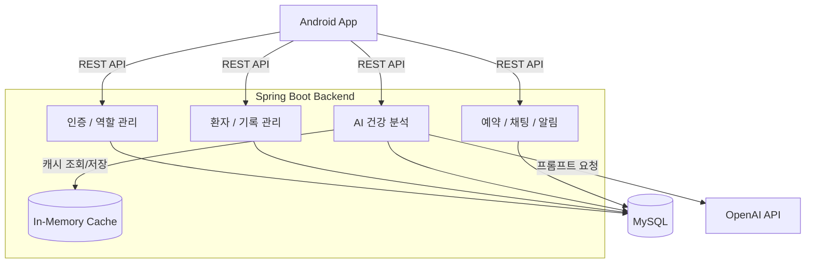
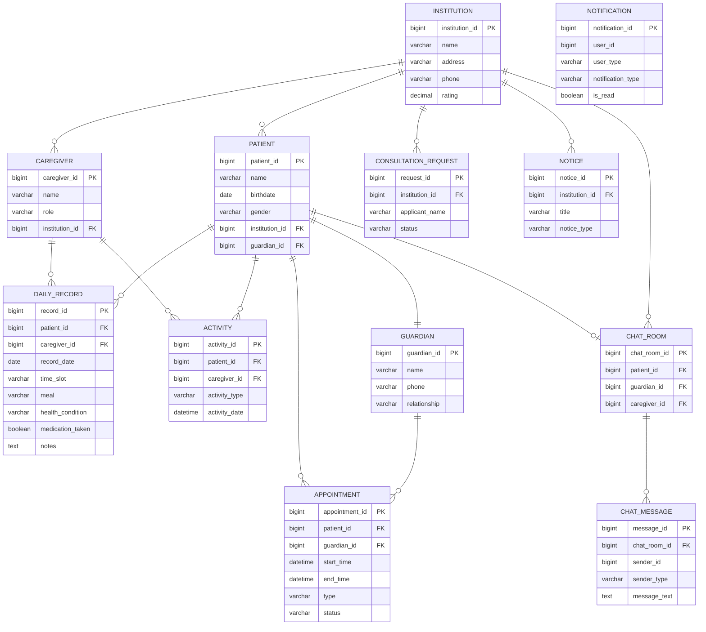

# 안심 요양원

> AI 기반 환자 상태 분석 및 이상 징후 대응 모바일 서비스
> 
> 🏆 디지털콘텐츠학회 대학생 논문 경진대회 **은상** (2025.11)

**문서** · [Notion](https://www.notion.so/APP-2c767a1b6c03801b9ec4cf6eba80c948) &nbsp;|&nbsp; **기간** · 2025.05 – 2025.11 &nbsp;|&nbsp; **팀** · 백엔드 3 / Android 1

---

## 프로젝트 소개

초고령 사회 진입과 함께 증가하는 요양 수요 속에서, 보호자–요양원 간 소통 부족과 정보 비대칭 문제를 해결하기 위해 개발한 모바일 기반 통합 플랫폼입니다.

요양보호사가 입력한 일별 기록을 AI가 자동 분석하여 이상 징후를 감지하고 보호자에게 알림을 전달합니다. 지도 기반 요양원 탐색, 면회 예약, 실시간 채팅, 공지사항 등 핵심 기능을 하나의 앱에서 제공합니다.

---

## 시스템 아키텍처



---

## ERD



---

## 기술 스택

| 영역 | 기술 |
|---|---|
| Backend | Java 17, Spring Boot 3.2, Spring Data JPA, Flyway |
| Database | MySQL 8.0 |
| AI / 외부 연동 | OpenAI API, Spring Retry |
| Android | Retrofit + OkHttp, Material Design, Google Maps API, FCM |

---

## 주요 기능

**비회원**
- Google Maps API 기반 주변 요양원 탐색
- 요양원 상담 문의 및 회신 수신

**보호자**
- 환자 일일 요양 기록(식사·투약·특이사항) 열람
- 활동 프로그램 내용 및 사진 확인
- 담당 요양보호사와의 채팅
- 캘린더 기반 면회·면담 신청 및 승인 확인
- AI 분석 기반 이상 징후 알림 수신

**요양원 (요양보호사)**
- 일일 요양 기록 입력 및 활동 프로그램 사진 업로드
- 최근 5일 데이터 기반 AI 건강 분석 요청
- 면회·면담 신청 승인 / 거부 관리
- 비회원 상담 문의 확인 및 회신

---

## API

<details>
<summary>인증</summary>

| Method | Endpoint | 설명 |
|---|---|---|
| POST | /api/auth/caregiver/login | 요양보호사 로그인 |
| POST | /api/auth/caregiver/signup | 요양보호사 회원가입 |
| POST | /api/auth/guardian/login | 보호자 로그인 |
| POST | /api/auth/guardian/signup | 보호자 회원가입 |

</details>

<details>
<summary>환자</summary>

| Method | Endpoint | 설명 |
|---|---|---|
| GET | /api/patients/{patientId} | 환자 단건 조회 |
| GET | /api/patients/institution/{institutionId} | 기관별 환자 목록 |
| GET | /api/patients/guardian/{guardianId} | 보호자별 환자 조회 |
| GET | /api/patients/caregiver/{caregiverId} | 담당 요양보호사별 환자 목록 |

</details>

<details>
<summary>일일 기록</summary>

| Method | Endpoint | 설명 |
|---|---|---|
| POST | /api/daily-records | 일일 기록 입력 |
| GET | /api/daily-records/patient/{patientId} | 환자 기록 전체 조회 |
| GET | /api/daily-records/patient/{patientId}/date/{date} | 날짜별 기록 조회 |

</details>

<details>
<summary>AI 건강 분석</summary>

| Method | Endpoint | 설명 |
|---|---|---|
| GET | /api/health-analysis/patient/{patientId} | 환자 AI 건강 분석 요청 |

</details>

<details>
<summary>예약</summary>

| Method | Endpoint | 설명 |
|---|---|---|
| POST | /api/reservations | 면회·면담 신청 |
| GET | /api/reservations/guardian/{guardianId} | 보호자별 예약 목록 |
| GET | /api/reservations/institution/{institutionId} | 기관별 예약 목록 |
| GET | /api/reservations/pending | 승인 대기 목록 |
| PUT | /api/reservations/{appointmentId}/approval | 승인 / 거부 처리 |
| PUT | /api/reservations/{appointmentId}/cancel | 예약 취소 |

</details>

<details>
<summary>채팅</summary>

| Method | Endpoint | 설명 |
|---|---|---|
| POST | /api/chat/rooms | 채팅방 생성 또는 조회 |
| POST | /api/chat/messages | 메시지 전송 |
| GET | /api/chat/rooms/{chatRoomId}/messages | 메시지 목록 조회 |
| GET | /api/chat/users/{userId}/rooms | 사용자 채팅방 목록 |

</details>

<details>
<summary>공지 / 상담 / 알림</summary>

| Method | Endpoint | 설명 |
|---|---|---|
| POST | /api/notices | 공지 작성 |
| GET | /api/notices/institution/{institutionId} | 기관 공지 목록 |
| PUT | /api/notices/{noticeId} | 공지 수정 |
| DELETE | /api/notices/{noticeId} | 공지 삭제 |
| POST | /api/consultation-requests | 상담 문의 등록 |
| GET | /api/consultation-requests/institution/{institutionId} | 기관별 문의 목록 |
| GET | /api/notifications/{userId} | 알림 목록 조회 |
| GET | /api/notifications/{userId}/unread-count | 미읽은 알림 수 |

</details>

---

## 앱 구동 영상

> 준비 중

---

## 실행 방법

### 사전 준비

```sql
CREATE DATABASE ansim_yoyang;
CREATE USER 'appuser'@'localhost' IDENTIFIED BY 'your_password';
GRANT ALL PRIVILEGES ON ansim_yoyang.* TO 'appuser'@'localhost';
```

### 백엔드

```bash
cd back
./gradlew bootRun
```

> Flyway가 애플리케이션 시작 시 DB 마이그레이션을 자동으로 수행합니다.

### Android 앱

```bash
cd front
./gradlew assembleDebug
```

### 환경 변수

```properties
openai.api.key=your_openai_api_key
spring.datasource.url=jdbc:mysql://localhost:3306/ansim_yoyang
spring.datasource.username=appuser
spring.datasource.password=your_password
```
